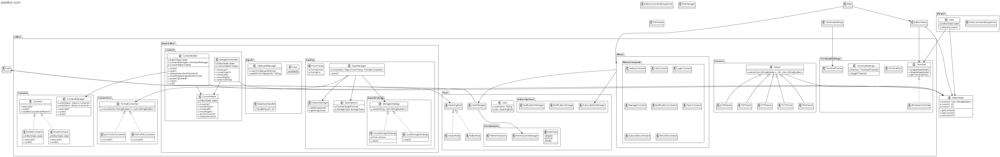

# Console Text Editor
This project is a feature-rich console-based text editor with support for multiple file formats, collaborative editing permissions, version history, and cloud integration. Developed as an advanced text manipulation tool with role-based access control.

## UI Description
The editor interface displays text content in a scrollable area with a status bar showing current position and editor state. The UI is optimized for terminal use with keyboard-driven navigation:

[Text content area - 20 lines visible]
**----------------------------------------**
Status: Row 45 | Col 12 | Modified | Dark Theme
Input command: _
Key Features & Commands
Basic Editing
## Navigation:
↑/↓/←/→ : Move cursor
Shift+Arrows : Select text
Ctrl+→/← : Word navigation

## Text Manipulation:
Backspace : Delete left character/selection
Enter : Insert new line
Type characters : Direct input

## Clipboard Operations
Ctrl+C : Copy selection

Ctrl+X : Cut selection

Ctrl+V : Paste from clipboard

History Management
Ctrl+Z : Undo last action

Ctrl+U : Redo last undone action

File Operations
Ctrl+O : Exit editor

Ctrl+S : Save file (triggers save dialog)
Save dialog prompts for:

Filename

Format (TXT, MD, RTF, JSON, XML)

Storage type (Local/Cloud)

Ctrl+N : Open new file

## Advanced Features
Ctrl+L : Search text
Enter search term in command mode
Cycles through matches

Ctrl+T : Toggle theme (Dark/Light/Green)

## Collaborative Editing
User roles:

Viewer : Read-only access

Editor : Full editing rights

Admin : Manage permissions

User management commands:

manage <filename> <username> <role>
Roles: viewer, editor, admin
**## Commands**
ls : List accessible files
Options:
-ls -e : Editor-accessible files
-ls -a : Admin-managed files
-ls -f <file> : Show file permissions

## Version Control
history <filename> --count : Show versions

history <filename> <version> : Restore snapshot

## Cloud Integration
Auto-saves to Google Drive when choosing cloud storage. Files are stored in predefined team folder.

## Subscriptions and notifications
subscribe <filename> : Get change notifications

unsubscribe <filename> : Stop notifications

notifications : View activity alerts
## Supported Formats
TXT : Plain text

MD : Markdown with live preview

RTF : Rich Text Format (basic styling)

JSON/XML : Structured data with syntax highlighting

## Workflow Example
open //to open the file

Edit content with keyboard

Ctrl+S to save:
Enter "document.md"
Select MD format
Choose Cloud storage

manage document.md colleague editor

subscribe document.md

## UML Diagram

## Requirements

Google Drive API credentials (for cloud features)

Terminal supporting ANSI escape codes

Configuration
Place Google credentials.json in project root

Set up permissions.json for user management

Create notifications/ directory for subscription storage

This editor combines traditional console editing with modern collaboration  it sfeatures, makinguitable for both individual use and team environments requiring access control and version tracking.